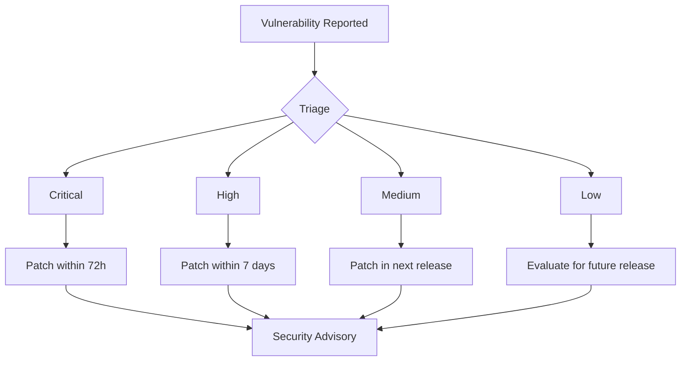

🔒 Security Policy

Supported Versions

The following versions of OSINT System are currently supported with security updates:

Version Supported Status
2.0.x ✅ Yes Active Support
1.5.x ✅ Yes Security Fixes Only
1.0.x ❌ No End of Life
< 1.0 ❌ No Not Supported

🚨 Reporting a Vulnerability

Important Notice

This tool is for educational purposes only. If you discover a vulnerability:

How to Report

1. DO NOT create public GitHub issues for security vulnerabilities
2. Email : king.aka.tyrant@,hotmail.com
3. Subject: "OSINT System Security Report - [Brief Description]"

What to Include in Your Report

· Description of the vulnerability
· Steps to reproduce
· Potential impact assessment
· Any proof-of-concept code (if available)
· Your contact information

🔄 Response Process

What to Expect

· Initial Response: Within 48 hours of report receipt
· Assessment: 3-5 business days for initial analysis
· Updates: Weekly status updates until resolution
· Resolution: Patch timeline depends on severity

Vulnerability Handling



⚠️ Severity Classification

Critical Severity

· Remote code execution
· Authentication bypass
· Data leakage of sensitive information
· Response: Immediate patch, private advisory

High Severity

· Privilege escalation
· Significant data exposure
· Denial of service
· Response: Patch within 7 days

Medium Severity

· Information disclosure (non-sensitive)
· Limited DoS capabilities
· Response: Patch in next scheduled release

Low Severity

· Minor information leakage
· UI/UX security issues
· Response: Addressed in future updates

🛡️ Security Best Practices

For Users

```bash
# Always use latest supported version
git pull origin main
docker-compose down
docker-compose up -d --build

# Regular security updates
make security-update

# Environment hardening
cp .env.example .env
# EDIT .env with secure values
```

For Developers

```bash
# Security scanning
make security-scan

# Dependency checking
make check-dependencies

# Code auditing
make audit-code
```

📋 Disclosure Policy

Private Disclosure

· Vulnerabilities are disclosed privately first
· 90-day disclosure deadline after patch release
· Coordinated disclosure with affected parties

Public Disclosure

· Security advisories published on GitHub
· CVE requests filed for significant issues
· Full transparency after patch availability

🔧 Security Tools Used

Automated Scanning

```yaml
# Included in CI/CD pipeline
- trivy: container vulnerability scanning
- safety: Python dependency checking  
- gosec: Go security checker
- owasp-dependency-check: Java dependencies
- semgrep: static code analysis
```

Manual Testing

· Penetration testing encouraged
· Code review required for contributions
· Architecture security reviews

📞 Contact

Security Team

· Email : king.aka.tyrant@hotmail.com
· Response Time: 24-48 hours for urgent matters
· PGP Key: Available upon request

Non-Security Issues

· Use GitHub Issues for feature requests
· Use GitHub Discussions for questions
· Do not use issues for security reports

📜 License Notice

Remember: This software is for educational purposes only. Users are responsible for:

· Obtaining proper authorization before use
· Complying with all applicable laws
· Ethical and responsible usage
· Understanding legal implications in their jurisdiction

---

Last Updated: 2024-06-26
Security Policy Version: 2.1
